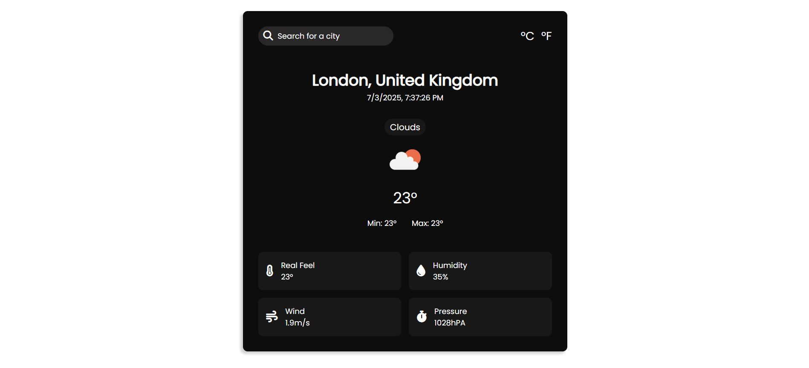

<h2 align="center">
  Weather App - 
  
Stay updated with the latest weather information!

</h2>

  

## Table of Contents

- [Introduction](#introduction)
- [Technologies Used](#technologies-used)
- [Features](#features)
- [API](#api)
- [Contact](#contact)
- [Show Your Support](#show-your-support)

## Introduction

Welcome to the Weather App! This application allows you to search for and view weather information for any city. It displays current weather data and supports both Celsius and Fahrenheit temperature units. Enjoy a responsive design for an optimal user experience across all devices.

## Technologies Used

This project was built using these technologies:

- HTML
- JS
- OpenWeather API
- CSS3
- VsCode

## Features

- Search for weather by city name.
- Display weather details including temperature, humidity, and weather conditions.
- Switch between Celsius and Fahrenheit.
- Responsive design for desktop devices.
- Dynamic search bar with suggestions.

## Usage

- Use the search bar to enter a city name and view its weather information.
- Switch between Celsius and Fahrenheit using the dropdown menu.

## API

This application uses the [OpenWeather API](https://openweathermap.org/api) to fetch weather data.

## Contact

Feel free to reach out to me at [mnav13p@gmail.com](mailto:manav13p@gmail.com) 

## Show Your Support

Give a ⭐ if you like this project!
